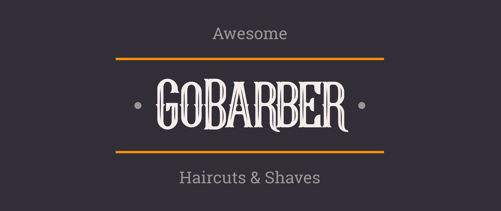

  

  

  

  

## :rocket: Technologies

This project was developed with the following technologies:

- [Node.js](https://nodejs.org/en/)
- [React](https://reactjs.org)
- [React Native](https://facebook.github.io/react-native/)

## 💻 Project

GoBarber is an application for scheduling barber services, where customers can make an appointment with their favorite barber in a practical and easy way.

## :memo: License

This project is under the MIT license. See the file [LICENSE](LICENSE) for more details.

---

Made with 💜 by Wesley Feitosa :wave: 
